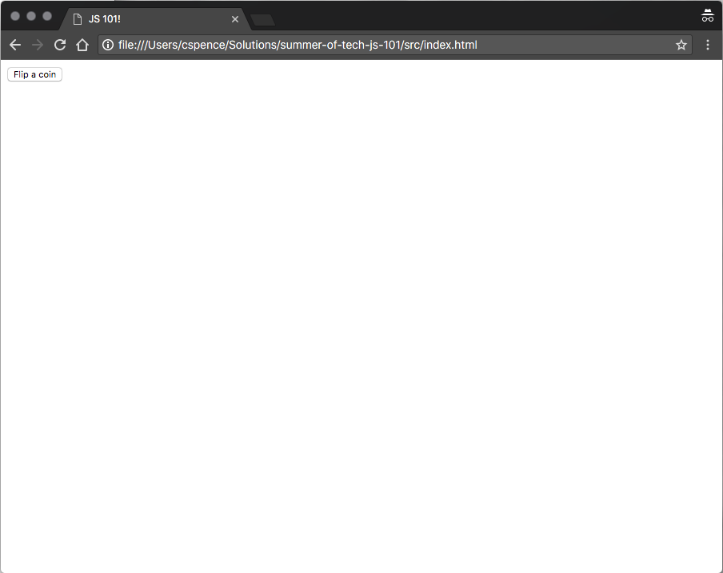

# Interacting with the DOM!

So JavaScript is all well and good as a language, but the really important thing about it is that it can run in a web page!

That means we can use **THE DOM**

## What is it?

The [**Document Object Model**](https://developer.mozilla.org/en-US/docs/Web/API/Document_Object_Model) allows us to manipulate parts on a HTML document with JavaScript! Neat!

Let's use the DOM, and try to run our "coin flip" code every time we click a button.

First, we need to add a button to our *index.html*, just *inside* the `<body></body>`.

That should look something like this:

```html
<body>
    <button
        id="flipCoin">
        Flip a coin
    </button>
</body>
```

Notice that we've given our button an `id`, and some text. If we reload the page, it should look something like this:



Pretty isn't it?

We're going to use **two** DOM functions to set up a "click" event handler for our button:

Let's modify our *index.html* to include a script tag that contains the following:

```javascript
let button = document.getElementById('flipCoin');
button.addEventListener('click', function () {
    alert('click');
});
```

There's a few things going on here.

First, we are *selecting* the `<button>`, using `getElementById` and the `id` that we gave it. We store the `button` in a variable.

Then, we are using `addEventListener` to attach a function to the `button`. This is like how we passed a function to our array methods earlier. The key difference here is **we do not know when that function will run!** This is because web pages, and JavaScript, are *asynchronous* by nature. That means things do not necessarily run in the order that they are declared. We can't predict *when* a user will click out button. We can just declare what we expect to happen when they do!

Now, our `click` handler is already very good, but we don't want to use `alert()` here. We want to flip a coin! We need to reuse our coin flipping code, and move it into the function that we give the button.

## Try it out!

Have a go at finishing up the coin flip button!

Once you've got that working, have a play with some other DOM functions. You could try [changing the colour of the button](https://developer.mozilla.org/en-US/docs/Web/HTML/Applying_color), or [creating a new HTML element with JavaScript](https://developer.mozilla.org/en-US/docs/Web/API/Document/createElement).

After that, for a real challenge, have a go at a **Paper Scissors Rock** game. This is definitely not going to be easy, and you'll probably need to search online for help, but you've got most of the pieces already. But for a hint, you might want to check out the [`prompt()`](https://developer.mozilla.org/en-US/docs/Web/API/Window/prompt) function some more!

That's it! I hope you enjoyed JS101, and I hope you found it useful!

## More info:

The DOM is one of the reasons that JavaScript has been so successful as a language. You can find out heaps more about it [here](https://developer.mozilla.org/en-US/docs/Web/API/Document_Object_Model/Introduction).
